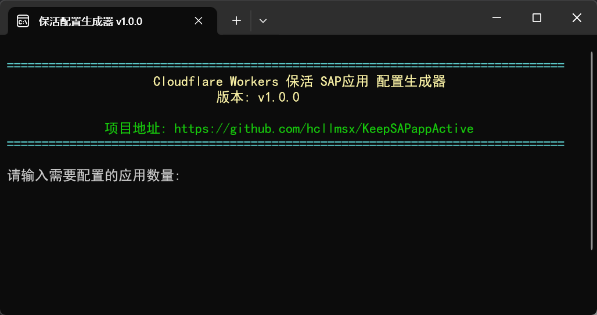

## KeepSAPappActive项目简介

KeepSAPappActive是一个Cloudflare Worker脚本，可以定期检查并确保SAP Cloud Foundry应用程序处于运行状态。

本项目基于[uncleluogithub的Cloudflare SAP APP KeepaLive脚本](https://gist.github.com/uncleluogithub/083775a84afbff11f1057695ce29fddb)进行了修改，`支持多SAP账户多应用`拉起保活。

## 部署指南

可参照这个视频[Uncle LUO演示视频中采取的方式](https://youtu.be/w-j8yPE2fKg?t=188)

### 部署步骤

1. 在Cloudflare Dashboard中创建一个新的Worker
2. 将`_worker.js`的内容复制到Worker编辑器中
3. 创建一个KV命名空间，命名为`START_LOCK`
4. 在Worker设置中绑定KV命名空间
5. 配置环境变量`APPS`为JSON数组，包含所有需要监控的应用信息
6. 设置Cron触发器：
   - 在Worker的"触发器"选项卡中，添加Cron触发器
   - 例如设置每天23点、0点、1点每2分钟执行一次：`*/2 23,0,1 * * *` （完美适配当前脚本）
   - 例如设置为每分钟执行一次：`* * * * *`
   - 例如设置为每2分钟执行一次：`*/2 * * * *`

### 环境变量配置说明

`APPS` 环境变量是一个JSON数组，包含所有需要监控的应用信息。每个应用配置包含以下字段：

#### 必选字段
- `CF_API`: Cloud Foundry API端点URL，例如 `https://your-cf-api-url`
- `UAA_URL`: UAA认证服务URL，例如 `https://your-uaa-url`
- `CF_USERNAME`: SAP用户名
- `CF_PASSWORD`: SAP密码

#### 应用标识（以下两种方式二选一）
1. 直接通过GUID标识（）：
   - `APP_GUID`: 应用的GUID（如果提供此字段，则无需提供APP_NAME、ORG_NAME和SPACE_NAME）

2. 通过名称、组织和空间标识：
   - `APP_NAME`: 应用名称
   - `ORG_NAME`: 组织名称
   - `SPACE_NAME`: 空间名称

#### 可选字段
- `APP_ID`: **推荐提供**，应用的唯一标识符，用于API调用和日志（如不提供，将使用索引号）
- `APP_PING_URL`: 应用启动后的健康检查URL，用于验证应用是否正常响应（AI修改的，我也不知道作用）

### 环境变量配置示例

环境变量名称就是`APPS`这个，它对应的值示例如下：

```json
[
  {
    "APP_ID": "app1",
    "CF_API": "https://your-cf-api-url",
    "UAA_URL": "https://your-uaa-url",
    "CF_USERNAME": "your-username",
    "CF_PASSWORD": "your-password",
    "APP_GUID": "your-app-guid"
  },
  {
    "APP_ID": "app2",
    "CF_API": "https://your-cf-api-url",
    "UAA_URL": "https://your-uaa-url",
    "CF_USERNAME": "your-username",
    "CF_PASSWORD": "your-password",
    "APP_NAME": "my-sap-app-1",
    "ORG_NAME": "my-org",
    "SPACE_NAME": "dev",
    "APP_PING_URL": "https://your-app-url/ping"
  }
]
```

上面这个示例中，`app1`和`app2`是两个应用，它们分别通过`第一种方式（GUID）`和`第二种方式（APP_NAME,ORG_NAME,SPACE_NAME）`进行配置。`app1`没有提供`APP_PING_URL`，因此它将不会进行健康检查。
> **【推荐】**：你可以只用app1这样的格式，app2也可以像app1这样写。这样就不需要配置`APP_NAME`、`ORG_NAME`和`SPACE_NAME`了。

### 使用保活配置生成器



你可以下载项目中这个`保活配置生成器.exe`（这是一个ps1脚本，只在本地运行，无联网功能），它协助你生成APPS环境变量配置。会在程序同目录下生成一个txt文件，复制里面的内容到环境变量配置中即可。

## 手动拉起应用

由于workers自带域名被阻断了，可能无法直接访问，推荐给workers绑定一个自定义域名，然后通过自定义域名访问。

Worker提供以下HTTP接口：

- `你的workers域名/` - 基本健康检查
- `你的workers域名/apps` - 列出所有配置的应用
- `你的workers域名/state?appId=app1` - 获取指定应用的状态
- `你的workers域名/start?appId=app1&force=1` - 启动指定应用（force=1可忽略锁定）
- `你的workers域名/stop?appId=app1` - 停止指定应用
- `你的workers域名/unlock?appId=app1` - 解除指定应用的启动锁定
- `你的workers域名/diag?appId=app1` - 获取应用配置的诊断信息

例如访问`https://your-worker-url/state?appId=app1`，如果应用处于停止状态，将会返回`{"status":"stopped"}`，如果应用处于运行状态，将会返回`{"status":"running"}`。

## 许可证

MIT

## 作者

[hcllmsx](https://github.com/hcllmsx/KeepSAPappActive)

## 致谢

本项目基于[uncleluogithub](https://gist.github.com/uncleluogithub/083775a84afbff11f1057695ce29fddb)的原始脚本进行了改进。