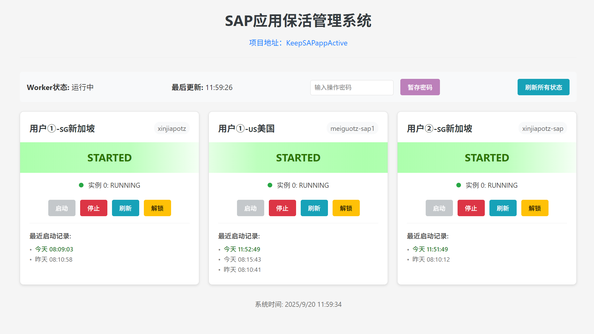
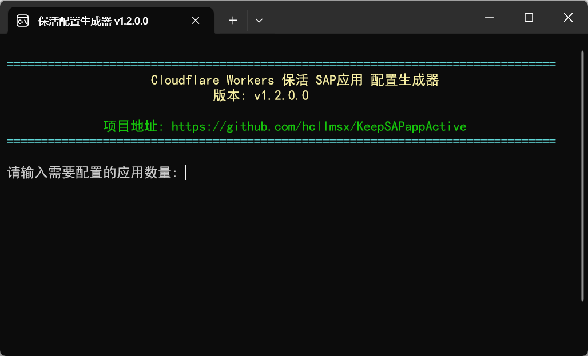

## KeepSAPappActive项目简介

KeepSAPappActive是一个Cloudflare Worker脚本，可以定期检查并确保SAP Cloud Foundry应用程序处于运行状态。

本项目基于[uncleluogithub的Cloudflare SAP APP KeepaLive脚本](https://gist.github.com/uncleluogithub/083775a84afbff11f1057695ce29fddb)进行了修改，`支持多SAP账户多应用`拉起保活。

## 前端页面（手动拉起应用以及应用信息查看）

由于workers自带域名被阻断了，可能无法直接访问，推荐给workers绑定一个自定义域名，然后通过自定义域名访问。

通过访问workers的域名，即可对应用进行相应的操作。如下图：

只有停止应用和解锁应用操作需要密码验证，输入密码后请点击“暂存密码”以保存设置，关闭网页后需要再次输入密码并进行暂存。

## 部署指南

可参照这个视频[Uncle LUO演示视频中采取的方式](https://youtu.be/w-j8yPE2fKg?t=188)

### 部署步骤

1. 在Cloudflare Dashboard中创建一个新的Worker
2. 将`_workers.js`的内容复制到Worker编辑器中
3. 创建一个KV命名空间，命名为`START_LOCK`
4. 在Worker设置中绑定KV命名空间
5. 配置环境变量`APPS`为JSON数组，包含所有需要监控的应用信息
6. 配置环境变量`FRONTEND_PWD`为一个密码
7. 设置Cron触发器：
   - 在Worker的"触发器"选项卡中，添加Cron触发器
   - 例如设置每天23点、0点、1点每2分钟执行一次：`*/2 23,0,1 * * *` （完美适配当前脚本）
   - 例如设置为每分钟执行一次：`* * * * *`
   - 例如设置为每2分钟执行一次：`*/2 * * * *`

### 环境变量配置说明

#### 环境变量`APPS`

`APPS` 环境变量是一个JSON数组，包含所有需要监控的应用信息。每个应用配置包含以下字段（仓库中 **APPS.json** 是示例）：

- `APP_ID`: 应用的唯一标识符，用于程序内部识别，比如API调用和日志（如不提供会有默认值）
- `APP_NAME`: 应用名称是用于前端显示的用户友好名称，在前端页面展示，用于备注。
- `CF_API`: Cloud Foundry API端点URL
- `UAA_URL`: UAA认证服务URL
- `CF_USERNAME`: SAP账户
- `CF_PASSWORD`: SAP密码
- `APP_GUID`: 应用的GUID

#### 环境变量`FRONTEND_PWD`

**FRONTEND_PWD** 环境变量是一个字符串，用于前端网页的密码。如果你不配置的话，默认值是`moren-+-MIMA`

## 使用保活配置生成器

你可以下载项目中这个`保活配置生成器-v版本号.exe`（这是一个ps1脚本，只在本地运行，无联网功能），它协助你生成APPS环境变量配置。会在程序同目录下生成一个txt文件，复制里面的内容到环境变量配置中即可。

如果你下载后被杀毒软件查杀，可以下载`保活配置生成器-v版本号.iso`，下载后双击这个文件，然后再打开里面的程序运行，不会被自动删除。

## 许可证

MIT

## 作者

[hcllmsx](https://github.com/hcllmsx/KeepSAPappActive)

## 致谢

本项目基于[uncleluogithub](https://gist.github.com/uncleluogithub/083775a84afbff11f1057695ce29fddb)的原始脚本进行了改进。